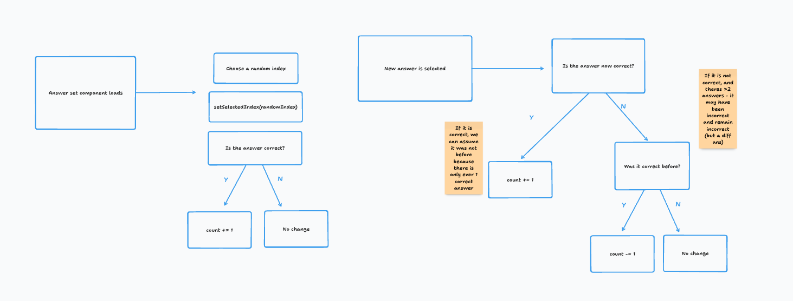

# Frontend Task

This repository is my implementation of a technical test for an EdTech company.

**For notes on my approach and limitations see "Notes" section below.**

## Requirements

### UI/UX requirements

- [x] The solution should lock once all correct answers have been selected so the toggles can no longer be switched
- [x] The toggles should animate between the two states (see attached video)
- [x] The background colour should change in proportion to how "correct" the answer is (see video attached)
- [x] The component should be responsive down to screens 320px wide

### Project requirements

- [x] State any assumptions or limitations of your solution in the repository readme
- [x] Host your solution in a Git repo on Github or Gitlab & email us the link once you are done
- [x] Please implement your solution in React + Typescript. You may choose any other tools and technologies as you see appropriate
- [x] The component should be reusable & extendable, it should be able to accommodate the question changing from that in the video to eg.:
  > Q. "What are the ideal conditions inside an office?" A. (good pay, bad pay) (lot of meetings, less meetings), (free coffee, expensive coffee), (bear in office, dog in office).

### What we are looking for

- A high-quality bar and close attention to detail
- This applies both to the UI/UX and to the quality of the code
- The code should be readable and maintainable by teammates
- The component should meet all the requirements listed above
- Although this task is for a small, one-off component, try to imagine it as part of a wider application and codebase, and structure your code accordingly
- You should be able to explain and back up any decisions made regarding your solution
- Have fun with it, and don’t be afraid to learn something new! :)

### Extension tasks

- [ ] The order of the questions & answer positions should be randomised
- [ ] Your solution should be able to accommodate answers with both two and three toggle positions in the answers. For example: Q. "Which are the best sports people & teams?" A. (Liverpool, Chelsea, Man Utd), (Serena Williams, Naomi Osaka)
- [x] You should make it easy to switch between the active question

## Notes

### Known limitations

**Changing questions**

Once the first question is complete, the user can click 'Next question...' to move to question 2. However, the counting of answers does not work beyond question 1.

I aimed to solve this using a `useEffect()` in the AnswerSet component to reset the `useRef()` - `initialCountCompleted` to false. My intention was that this would trigger a recalculation of how many answers are correct in the existing `useEffect()`. However, I found this would disrupt the calculation of the first questions correctness.

In this case, I made the call to prioritise demonstrating one working question with randomised answers over resolving the issue. I could see a resolution which involved rearchitecting the entire component which I decided not to do.

If I was to encounter this problem in a real-world situation, I'd seek guidance from another developer either by rubber ducking or explaining the issue to a more senior dev.

I have left my solution commented out in `<AnswerSet />`, and is as follows:

```ts
// When the question changes, reset the count of correct
useEffect(() => {
  initialCountCompleted.current = false;
  setSelectedIndex(Math.floor(Math.random() * answerArr.length));
}, [curQuestion]);
```

**Accommodation of >2 answers**

While I have made some progress towards accommodating answer sets which contain more than two answers, my AnswerSet component is designed for two answers only.

I found that the component rendered inconsistently where my responsive rule wasn't always picked up as a Tailwind Class. I prioritised the component rendering correctly for 2 answers over inconsistent responsive rendering. The rules that I'd calculated are below and would be passed inside a template literal class for the component.

```ts
const width = `w-1/${answerArr.length}`;
const height = `h-1/${answerArr.length}`;
```

**Randomisation of question & answer order**

Chosen answer positions are randomised on page load. There is a small chance that all the correct answers will be selected on load which is a scenario I did not handle due to it being improbable.

Questions and answers will render in the order they are defined in the dataset. If I was to randomise those, I'd do so using a shuffle function and then passing the data in shuffled order to the `<AnswerSet />` component.

Randomising the question order would require tracking the number of completed questions in a state variable. Additionally, a button could be added to move back to a previous question. For this approach, storing the outcome (whether all answers are correct) for each question would be important.

### Approach

My first consideration was the architecture of the component and how to strucutre my data. I wanted to create reusable components wherever possible, such as for each set of answers.

Initially, I structured the data as two variables:

1. question (a string)
2. answers (an array of objects, each object has the answer text and a boolean indicating correctness)

In the final version, you'll see the `<AnswerSet />` as its own component and the question stored as a JSON object inside respective folders for components and data. While building, I had everything inside `<App />` for convenience of development.

The final setup is advantageous as it gives a better sense of modularity for the subcomponent. Data can be altered without changing the `<App />` component which imitates calling an API or database object.

**Whiteboarding**

When I hit a stumbling block, I took a step back and mapped out my ideas on a (virtual) whiteboard. Here's a couple of screenshots showing my working through tricky parts.




**Handling the tricky parts**

I found a few parts of the build particularly challenging, namely:

1. Structuring the toggle component for a nice visual experience
1. Randomising answer starting positions

When faced with a tricky problem, my approach is generally something like this:

1. Reread the code, looking out for any obvious errors
1. Comment out parts which aren't working to get the simplest solution
1. `Console.log()` variables, states and figure out what might be happening
1. Look for tutorials, videos or articles explaining the topic
1. Consult generative AI with my specific problem

Coming unstuck is an important part of the process and carefully considering the code that I'm adding to my codebase helps me to get a good handle on the codebase as a whole.

For example, I haven't used `useRef()` many times before. I implemented both in order to calculate the size of the toggle container and to verify if the initial correctness count had been completed. These two uses have helped me to build my understanding of how to fix values in React without causing unnecessary rerenders.

**Iterations**

I built this project iteratively, starting with the simplest solution I could come up with. As I built out more of the project, I was able to refactor parts of the codebase and streamline the final implementation.
